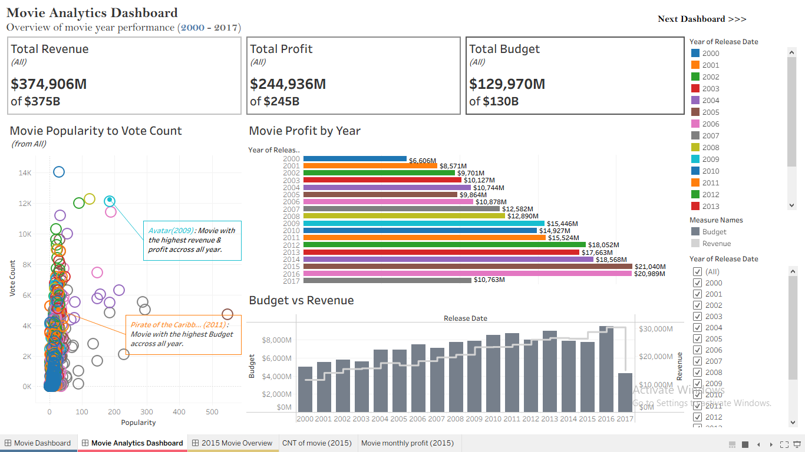
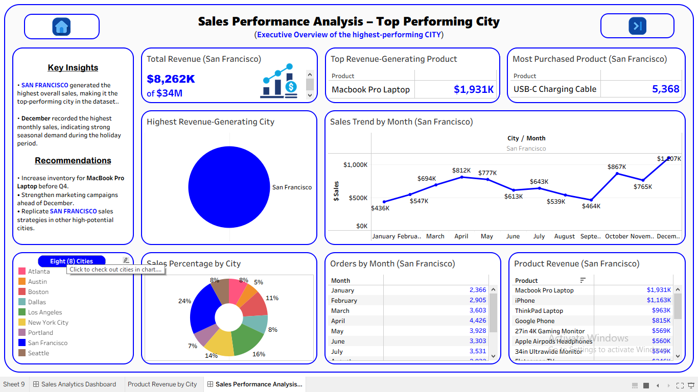

# My-Profile

## Hi there, I'm Opeyemi 👋

  

  
  
  
  

---

## 🚀 About Me

I am an aspiring Data Analyst with a strong passion for transforming raw data into clear, meaningful insights that support better decision-making.

I enjoy exploring data, identifying trends, and creating clear visualizations that help uncover valuable business insights. My goal is to continuously grow as a data professional and contribute to organizations by using data to solve real-world problems.
I am actively seeking opportunities to collaborate, and gain hands-on experience in the field of data analytics.

Skills: Python • SQL • Tableau • Pandas • Data Cleaning • Data Visualization • Exploratory Data Analysis

---

### 🌐 Portfolio Website
👉 **🌐 Portfolio Website Coming Soon......** I'm currently developing my personal portfolio website. In meantime, explore my GitHub portfolio to view my end-to-end data analytics and business analysis projects.

---

## 🔭 Featured Analytics Project

### 📊 Sales Data Analysis
Performed end-to-end retail sales analysis using Python and Tableau to uncover revenue trends, top-performing products, customer purchasing patterns, and actionable business insights through interactive dashboards.

💹 [Sales Data Analysis Project](https://github.com/Cephasia/Sales-Data-Analysis)

---
### 💼 Job Market Analysis
Analyzed real-world job market trends to identify hiring demand, top recruiting companies, in-demand locations, and employment opportunities using data visualization and exploratory data analysis.

💹 [Job Market Analysis Project](https://github.com/Cephasia/job-market-analysis)

---
### 📈 Data Job Postings Analysis
Cleaned and analyzed over 975 real-world data job postings using Python, Excel, and Tableau to identify the most in-demand roles, leading hiring companies, top job locations, recruitment platforms, and market trends through executive dashboards.

💹 [Data Job Postings Project](https://github.com/Cephasia/Data-Job-Postings-Analysis)

---
### 📉 End-to-end Analytics Solution
Developed a complete analytics workflow covering data acquisition, cleaning, transformation, exploratory data analysis, dashboard development, and business reporting to support data-driven decision-making.

💹 [End to End Analytics Project](https://github.com/Cephasia/end-to-end-Analytics-Solution)

---
### 🏦 Nigeria Commercial Banking Experience Analysis (Coming Soon)
An Excel-based business analysis project comparing Nigeria's leading commercial banks using customer experience, digital banking performance, transaction charges, accessibility, and service quality to uncover actionable business insights and recommendations.

💹 [Coming Soon!](README.md)

## 📊 Dashboard Gallery
<table>
<tr>
<td width="33%" valign="top">
<h3 align="center">📈 Sales KPI Dashboard</h3>

  .png)

An executive sales performance dashboard that monitors key business metrics, regional sales trends, profitability, product performance, and year-over-year growth to support strategic business decisions.
</td>

<td width="33%" valign="top">
<h3 align="center">🎬 Movie Analytics Dashboard</h3>

An interactive movie analytics dashboard exploring revenue, budget, profit, popularity, and voting trends to uncover the financial performance of films released between 2000 and 2017.
</td>

<td width="33%" valign="top">
<h3 align="center">🏙️ Sales Performance Analysis Dashboard</h3>

A city-level sales performance dashboard highlighting the highest-performing city through revenue analysis, product performance, monthly sales trends, customer purchasing behavior, and executive business insights.
</td>
</tr>
</table>

---

## 🛠️ Technical Skillset

### Data Analysis & Cleaning 

  
  

### Dashboard Development 
  

### Programming & Automation

  
  
  

    Opeyemi (Ismail) Peter
